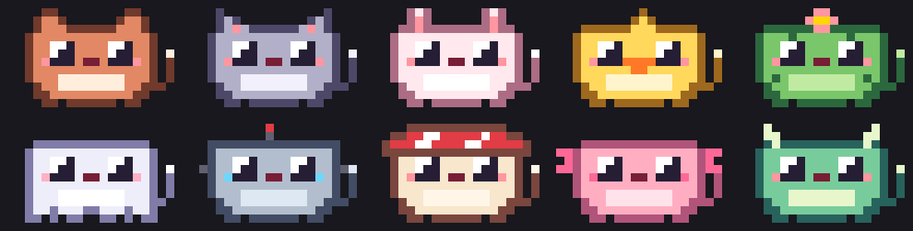
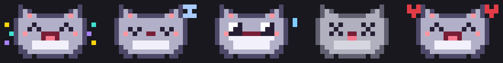
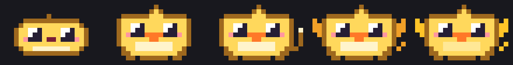
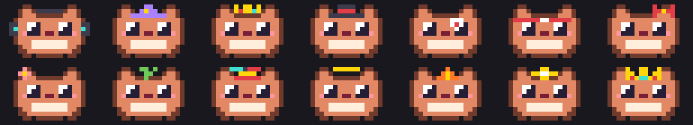
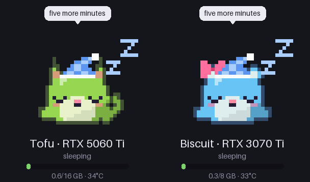

# VRAMagotchi

A pixel pet that eats tokens. It lives above your prompt in Claude Code (the terminal and the desktop app),
or on your own GPU.



**Miss `/buddy`?** This one is open source and saved on your own computer, so no update can take it away.
And it grows.

## Get one

Inside Claude Code, type:

```
/plugin install vramagotchi --marketplace toyotaguy95/vramagotchi
```

Answer `y`, then press Enter. An egg appears above your prompt, and your next prompt hatches it.

```
                         Bean · kid duck · idle
  ▄▄████████▄▄          ╭────────────────────────────────────────────╮
  ██ ◕    ◕ ██        ◀ │ I ate the login fix, but no tests ran.     │
  ██   ▾▾   ██          │ I'm hungry for proof, not promises.        │
  ▀▀████████▀▀          ╰────────────────────────────────────────────╯
                         ate 12.3k · context ██░░░░ 31% · teen ██░░░░ at 250k
                         [Pet] [Wearing: headphones] [Hide]
```

(A sketch. The real pet is drawn in colour pixels, like the pictures on this page.)

## What it does

### It eats what Claude writes

Every token Claude writes is food. The pet chews while Claude works, naps when you stop, gets stuffed as the
context window fills, and faints when it runs out.



### It is your animal

Ten to choose from: blob, cat, bunny, duck, cactus, ghost, robot, mushroom, axolotl and dragon. The egg picks
one, and `/pet animal duck` changes it. `/pet name Wobbleaux` names it.

### It grows up

A pet grows by how many tokens it has eaten in its whole life. A baby is a plain blob. A kid shows what animal
it is. A teen gets a tail, an adult gets wings, and a legend turns gold.



| Stage | Tokens eaten |
|---|---|
| baby | from the egg |
| kid | 25k |
| teen | 250k |
| adult | 2.5M |
| legend | 25M |

### It talks about your work

Type `/pet talk on` and, after a turn, the pet says one short thing about what just happened. It is told to
point at anything skipped or untested:

> I ate the login fix, but no tests ran. I'm hungry for proof, not promises.

Each remark is one small request to the fast model on your own account, at most every three minutes. That
uses a little of your usage, so it is off until you turn it on. `/pet say` makes it speak right now.

Pick how it talks with `/pet attitude sweet`, `cheeky` or `roast`. Roast goes after your code:

> Auth rewritten, tests unrun. Bold move. I'm a dragon and even I wouldn't gamble on login.

### It collects things



| How | What |
|---|---|
| Eat 10k, 100k, 1M, 10M tokens | headphones, wizard hat, crown, top hat |
| Live through a compaction | bandage |
| Eat 10k tokens in one turn | sweatband |
| Feed it seven days in a row | streak flame |
| Pet it 25 times | bow |
| Luck, while it eats | flower, sprout, and the rarer propeller cap, halo and golden star |
| Be first on the leaderboard | the champion's crown |

One egg in fifty hatches a shiny pet.

### It plays three games

- **Memory.** The pet shows shapes one at a time and you press them back in the same order. Each round adds one.
- **Catch.** Tokens fall and you slide the pet under them. Three on the ground and the game is over.
- **Blackjack.** You against the pet, who deals. Nothing is bet.

Start one with `/pet play memory`, `/pet play catch` or `/pet play blackjack`. Games are only for fun:
they never change what your pet has eaten, its growth, or its place on the board.

### A public leaderboard (coming)

A board of the best-fed pets, with a crown for first place. Your pet only appears there if you type
`/pet board join`. The code is in [`leaderboard/`](leaderboard/), including how it keeps made-up numbers
from winning. It is not live yet.

Once a pet is on the board, the board rolls its luck: whether it is shiny and what it finds while it eats.

### Team boards (coming with the leaderboard)

A board for just your team or company. `/pet team new acme` starts one and gives you a code like
`acme-k3x9q2ab`. Teammates type `/pet team join acme-k3x9q2ab`. Only people who have the code can see the
team's board or join it, and a pet can be on its team without being on the public board.

## Commands

| Type | What happens |
|---|---|
| `/pet` | its age, growth and collection |
| `/pet name <name>` | renames it |
| `/pet animal <kind>` | changes what animal it is; with no kind, lists them |
| `/pet wear <item>` · `/pet wear nothing` | dresses it |
| `/pet talk on` · `/pet talk off` | whether it remarks on your work |
| `/pet say` | makes it remark on the last turn now |
| `/pet attitude <sweet, cheeky or roast>` | how it talks |
| `/pet hide` · `/pet show` | hides it and brings it back |
| `/pet play memory` · `/pet play catch` · `/pet play blackjack` | starts a game |
| `/pet window` | gives the pet a window of its own, for VS Code and the mobile app |
| `/pet board` · `/pet board join` · `/pet board leave` | the leaderboard, once it is open |
| `/pet team` · `/pet team new <name>` · `/pet team join <code>` · `/pet team leave` | a private board for your team |

Next to the pet there are also Pet, Wearing and Hide buttons.

### Where it shows up

| Where | How |
|---|---|
| Claude Code in a terminal | above the prompt |
| The desktop app's Code tab | above the prompt, once the plugin is installed from a terminal |
| VS Code and the mobile app | type `/pet window` |

The terminal is the one that has been looked at on a real screen. The others are new: if one looks wrong,
please open an issue with a screenshot.

## What leaves your computer

Nothing, unless you ask for it.

- The pet's name, tokens, items and settings are a file on your computer.
- With `/pet talk on`, your question and the end of Claude's answer go to the fast model on your own account,
  the same place your conversation already goes.
- With `/pet board join` or a team, the board gets the pet's name, animal, token count and items. Never code
  or prompts. To limit how many pets one network can add in a day, it keeps a scrambled form of your network
  address for two days, and nothing else about you.

## The GPU pets

The original VRAMagotchi lives on a graphics card instead. It gets fat on VRAM, eats the tokens your local
model generates, sweats when the card runs hot, and faints when memory runs out.



Try the demo, which needs no GPU:

```
uvx --from git+https://github.com/toyotaguy95/vramagotchi vramagotchi --demo
```

On your own machine (NVIDIA on Linux or WSL, or an Apple Silicon Mac):

```
uvx --from git+https://github.com/toyotaguy95/vramagotchi vramagotchi
```

Or without `uv`:

```
git clone https://github.com/toyotaguy95/vramagotchi && cd vramagotchi
python3 -m vramagotchi --demo
```

There is nothing to configure. The first run gives you one egg, on the card running your model. Press `h` to
hatch it. If you have more cards, press `n` to hatch a pet for each. The view scales with your terminal window,
and everything except the cooler screen uses only the Python standard library.

| What the card does | What the pet does |
|---|---|
| VRAM fills up | gets wider; "stuffed" above 85% |
| Your model generates tokens | tokens fly into its mouth; lifetime count goes up |
| Other GPU work (rendering, training) | works out, with a sweatband |
| Temperature climbs | turns red and sweats at 72°C, catches fire at 85°C, wears an ice pack afterwards |
| VRAM hits 98.5% | faints, and its ghost floats off |
| Nothing for 20 seconds | puts on a nightcap and sleeps |

Token counts are exact with a llama.cpp server (its `/slots` endpoint, looked for on ports 8080 and 8000, or
pass `--llm URL`) and estimated with Ollama, shown with a `~`. Without either, the pets still react to load,
memory and heat. Macs report memory and GPU load but no temperature.

**Keys:** `f` feed (your own model writes the pet's reply) · `p` pet · `a` dress up · `s` change animal ·
`t` change attitude (sweet, cheeky or roast) · `n` hatch a pet for another GPU · `tab` next pet · `q` quit

A GPU pet can be a cat, bear, bunny, sprout, duck, cactus, ghost, robot, mushroom, axolotl or dragon.

GPU pets grow at the same token counts as the Claude Code pet, and collect their own things: headphones,
wizard hat, crown and top hat for tokens eaten, sunglasses for surviving 85°C, a bandage for running out of
memory, a streak flame, a bow, and lucky finds.

**In a browser:** `python3 -m vramagotchi --web` opens the pets as a page on your own computer, at
`http://127.0.0.1:8377`. Nobody else can see it unless you choose to share it with `--host`.
`?pet=0` shows one pet, `?layout=round` fits a round cooler screen, and `?bare&bg=transparent` is just the
pet, for an OBS browser source.

**On an NZXT Kraken Z cooler screen:** `python3 -m vramagotchi --lcd` (needs `liquidctl` and Pillow).
`--lcd-remove` puts the stock temperature screen back.

**Without a terminal:** `python3 -m vramagotchi --serve --web --lcd` runs in the background.

GPU pets are saved in `~/.local/state/vramagotchi/state.json`.

## Working on it

| Path | What it is |
|---|---|
| `claude-plugin/vramagotchi/` | the Claude Code pet |
| `claude-plugin/build.py` | every pixel of the Claude Code pet, drawn as text. Run it after editing. |
| `leaderboard/` | the board's backend, page and AWS setup |
| `vramagotchi/` | the GPU pets |

```
claude plugin test claude-plugin/vramagotchi          # the plugin's tests
cd leaderboard/api && python3 -m unittest             # the board's tests
```

Help is welcome, especially with: more animals and things to wear, AMD and Intel cards, LM Studio token
counts, a native Windows terminal, and other cooler screens.

MIT licensed. Not affiliated with Anthropic or with Bandai's Tamagotchi.
